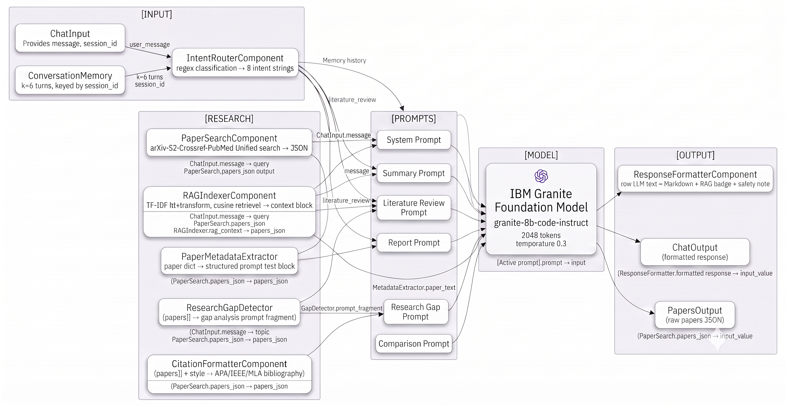
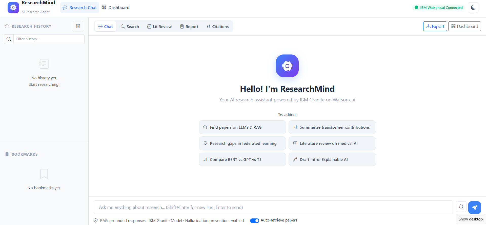
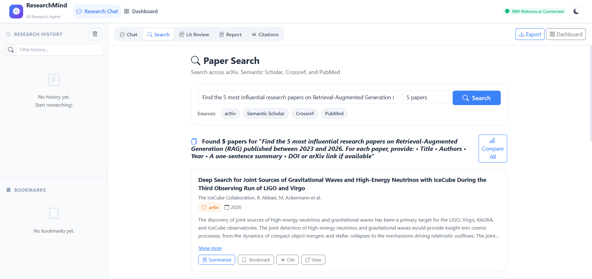
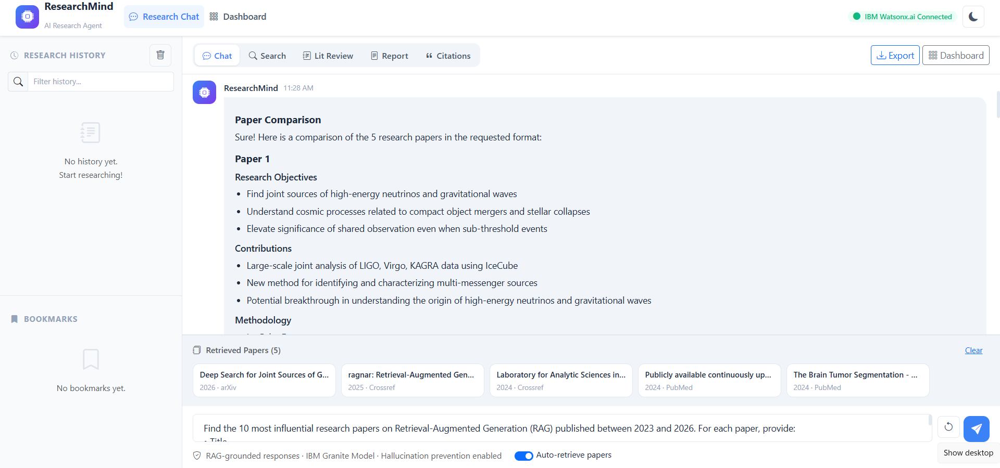
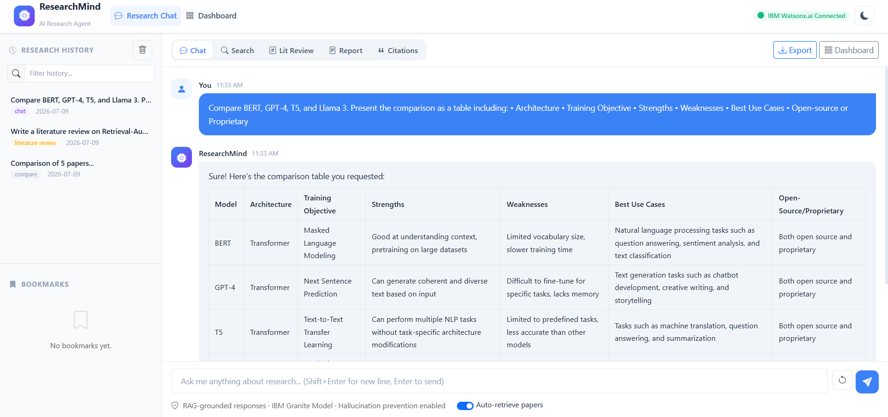
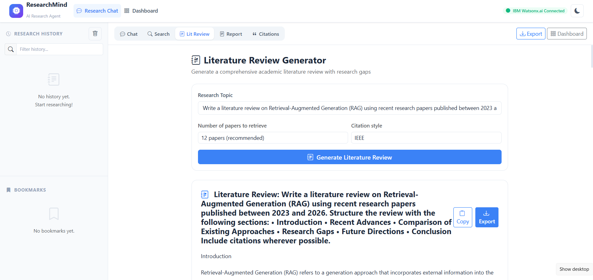
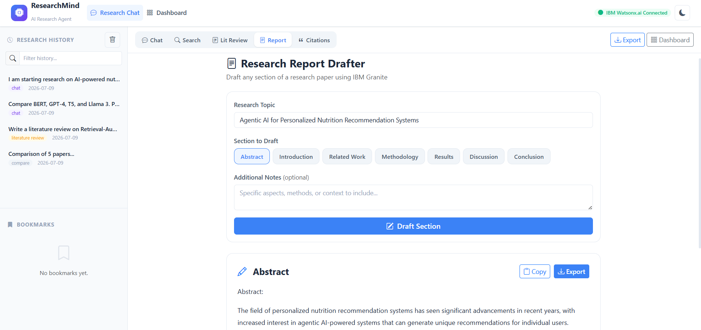
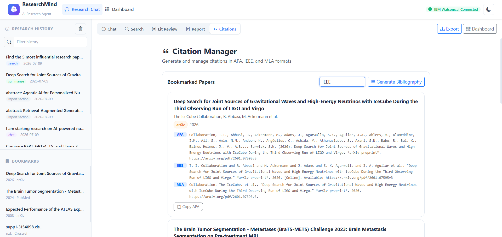
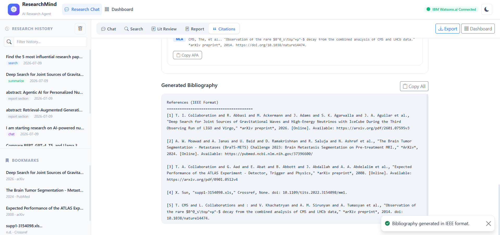

# ResearchMind — AI-Powered Research Agent

An AI-powered research assistant built with **IBM Granite**, **IBM watsonx.ai**, and **Retrieval-Augmented Generation (RAG)** to automate literature discovery, review generation, citation management, and academic report drafting.

> Powered by **IBM Granite** on **IBM watsonx.ai**

[](https://python.org)
[](https://flask.palletsprojects.com)
[](https://www.ibm.com/granite)
[](https://www.ibm.com/watsonx)
[](https://getbootstrap.com)
[](https://opensource.org/licenses/MIT)

---
## Live Application - https://research-agent-v3ro.onrender.com

---

## Table of Contents

- [Overview](#overview)
- [Why ResearchMind?](#why-researchmind)
- [Key Features](#key-features)
- [Visual Overview](#visual-overview)
  - [ResearchMind AI Research Agent Workflow](#researchmind-ai-research-agent-workflow)
  - [Architecture Blueprint](#architecture-blueprint)
  - [Application Screens](#application-screens)
  - [ResearchMind: Intelligent Research Cycle](#researchmind-intelligent-research-cycle)
- [Implementation Details](#implementation-details)
  - [Codebase Structure](#codebase-structure)
  - [RAG Pipeline](#rag-pipeline)
- [Quick Start](#quick-start)
- [Getting IBM Credentials](#getting-ibm-credentials)
- [Customising the Agent](#customising-the-agent)
- [API Reference](#api-reference)
- [Production Deployment](#production-deployment)
- [IBM Cloud Lite Compatibility](#ibm-cloud-lite-compatibility)
- [Usage Guide](#usage-guide)
- [Technologies Used](#technologies-used)
- [Troubleshooting](#troubleshooting)
- [License](#license)
- [Acknowledgements](#acknowledgements)

---

## Overview

**ResearchMind** is a production-ready AI research assistant that autonomously supports the full academic research lifecycle — from paper discovery and summarisation to literature review generation and citation management — using **IBM Granite models** on **IBM watsonx.ai** and **Retrieval-Augmented Generation (RAG)** for factually grounded responses.

---

## Why ResearchMind?

✔ Automates the complete academic research workflow

✔ Retrieves and synthesizes papers from multiple scholarly databases

✔ Generates grounded responses using IBM Granite + RAG

✔ Produces publication-ready citations and literature reviews

✔ Ready for deployment on IBM Cloud Lite

---

## Key Features

| Feature | Description |
|---|---|
| **AI Research Chat** | Natural language Q&A grounded in retrieved papers via RAG |
| **Multi-Database Search** | arXiv, Semantic Scholar, Crossref, PubMed — unified results |
| **Paper Summarizer** | Structured extraction: objectives, methodology, results, limitations |
| **Paper Comparison** | Side-by-side markdown tables for up to 6 papers |
| **Literature Review** | Full academic review with themes, gaps, and future directions |
| **Report Drafter** | Draft any paper section (Abstract → References) with Granite |
| **Research Gap Analysis** | Identify contradictions, gaps, and testable hypotheses |
| **Citation Manager** | APA 7th, IEEE, MLA 9th — single papers or full bibliography |
| **PDF & DOCX Export** | Professional report exports with cover page and references |
| **Bookmarks & History** | Persistent research history and paper bookmarks |
| **Dark / Light Mode** | One-click theme switching, fully responsive |

---

# Visual Overview

## ResearchMind AI Research Agent Workflow

<p align="center">
  
</p>

---

## Architecture Blueprint

<p align="center">
  
</p>

---

## Application Screens

| Home Page | Paper Discovery |
|-----------|-----------------|
|  |  |

| Paper Comparison | Foundation Model Comparison |
|------------------|-----------------------------|
|  |  |

| Literature Review | AI-Assisted Research Report Drafting |
|-------------------|--------------------------------------|
|  |  |

| Citation Management | Bibliography Generation |
|----------------------|-------------------------|
|  |  |

---

## ResearchMind: Intelligent Research Cycle

<p align="center">
  
</p>


---

# Implementation Details

## Codebase Structure

```
research-agent/
│
├── app.py                   # Flask app — all REST API endpoints
├── config.py                # ⭐ AGENT_INSTRUCTIONS — customise agent behaviour
├── requirements.txt         # Python dependencies
├── env.example              # Environment variables template (rename to .env)
│
├── services/
│   ├── __init__.py
│   ├── watsonx_service.py   # IBM Granite LLM integration (chat, summarise, review)
│   ├── research_service.py  # arXiv, Semantic Scholar, Crossref, PubMed APIs
│   └── rag_service.py       # TF-IDF RAG for hallucination prevention
│
├── utils/
│   ├── __init__.py
│   ├── citation_utils.py    # APA / IEEE / MLA citation generation
│   └── export_utils.py      # PDF (ReportLab) + DOCX (python-docx) export
│
├── templates/
│   ├── base.html            # Bootstrap 5 base layout + navbar
│   ├── index.html           # Main chat + search + review + report UI
│   └── dashboard.html       # Analytics dashboard + history + bookmarks
│
├── static/
│   ├── css/style.css        # Custom academic theme + dark mode
│   └── js/
│       ├── main.js          # Shared utilities (API, Toast, Theme, Clipboard)
│       ├── chat.js          # Chat, Search, Review, Report, Citations modules
│       └── dashboard.js     # Dashboard charts and interactivity
│
└── exports/                 # Generated PDF/DOCX files (auto-created)
```

## RAG Pipeline

```
User Query
    │
    ├─→ Research APIs (arXiv • Semantic Scholar • Crossref • PubMed)
    │       └─→ Retrieve top-N relevant papers
    │
    ├─→ RAG Service (TF-IDF vectoriser)
    │       └─→ Rank papers by query similarity
    │       └─→ Build context string (top-K papers)
    │
    └─→ IBM Granite (Watsonx.ai)
            └─→ Prompt = System + RAG Context + User Query
            └─→ Grounded, citation-backed response
```

---

## Quick Start

### Prerequisites

- Python 3.9 or higher
- IBM Cloud account (free tier works)
- IBM watsonx.ai project with Granite model access

### 1. Clone the Repository

```bash
cd research-agent
```

### 2. Create a Virtual Environment

```bash
# Windows
python -m venv venv
venv\Scripts\activate

# macOS / Linux
python3 -m venv venv
source venv/bin/activate
```

### 3. Install Dependencies

```bash
pip install -r requirements.txt
```

### 4. Configure Environment Variables

```bash
# Copy the template
cp env.example .env
```

Edit `.env` and fill in your IBM Cloud credentials:

```env
IBM_CLOUD_API_KEY=your_ibm_cloud_api_key_here
WATSONX_PROJECT_ID=your_watsonx_project_id_here
WATSONX_URL=https://us-south.ml.cloud.ibm.com
FLASK_SECRET_KEY=change_this_to_a_random_string
```

### 5. Run the Application

```bash
python app.py
```

Open your browser at **http://localhost:5000**

---

## Getting IBM Credentials

### IBM Cloud API Key

1. Go to [IBM Cloud](https://cloud.ibm.com)
2. Click your profile → **Manage** → **Access (IAM)**
3. Navigate to **API Keys** → **Create an IBM Cloud API Key**
4. Copy the key into your `.env` file as `IBM_CLOUD_API_KEY`

### watsonx.ai Project ID

1. Open [IBM watsonx.ai](https://dataplatform.cloud.ibm.com)
2. Create or open a project
3. Go to **Manage** tab → **General** → copy the **Project ID**
4. Paste it into `.env` as `WATSONX_PROJECT_ID`

### Service URL

Select the URL matching your IBM Cloud region:

| Region | URL |
|--------|-----|
| US South (default) | `https://us-south.ml.cloud.ibm.com` |
| EU Germany | `https://eu-de.ml.cloud.ibm.com` |
| EU UK | `https://eu-gb.ml.cloud.ibm.com` |
| Japan Tokyo | `https://jp-tok.ml.cloud.ibm.com` |
| Australia Sydney | `https://au-syd.ml.cloud.ibm.com` |

---

## Customising the Agent

All agent behaviour is controlled via the **`AGENT_INSTRUCTIONS`** dictionary in [`config.py`](config.py). You never need to modify any other file.

```python
AGENT_INSTRUCTIONS = {
    # Agent identity
    "name": "ResearchMind",

    # Domain expertise (affects search relevance)
    "domain_expertise": ["computer_science", "artificial_intelligence"],

    # Response style: "academic" | "conversational" | "concise" | "detailed"
    "response_tone": "academic",

    # Default citation format: "APA" | "IEEE" | "MLA"
    "default_citation_style": "APA",

    # Database query order
    "preferred_databases": ["arxiv", "semantic_scholar", "crossref", "pubmed"],

    # Summary detail: "short" | "medium" | "long"
    "summary_length": "medium",

    # Sections extracted from each paper
    "summary_sections": ["objectives", "methodology", "results", "limitations"],

    # Safety rules (injected into every prompt)
    "safety_guidelines": [
        "Never fabricate paper titles, authors, or DOIs.",
        ...
    ],

    # RAG / hallucination prevention settings
    "hallucination_prevention": {
        "enabled": True,
        "rag_grounding": True,
        "confidence_threshold": 0.6,
        "max_context_papers": 5,
    },

    # Master system prompt for all LLM calls
    "system_prompt": "You are ResearchMind, ...",
}
```

---

## API Reference

All endpoints return:
```json
{
  "success": true,
  "message": "OK",
  "data": { ... },
  "timestamp": "2025-01-01T00:00:00"
}
```

| Method | Endpoint | Description |
|--------|----------|-------------|
| `GET` | `/` | Main chat interface |
| `GET` | `/dashboard` | Research dashboard |
| `GET` | `/api/status` | Health check + service status |
| `POST` | `/api/chat` | AI chat with RAG grounding |
| `POST` | `/api/search` | Multi-database paper search |
| `POST` | `/api/summarize` | Structured paper summary |
| `POST` | `/api/compare` | Compare multiple papers |
| `POST` | `/api/literature-review` | Generate literature review |
| `POST` | `/api/report-section` | Draft a report section |
| `POST` | `/api/research-gaps` | Identify research gaps |
| `POST` | `/api/citations` | Generate APA/IEEE/MLA citations |
| `POST` | `/api/export/pdf` | Export report as PDF |
| `POST` | `/api/export/docx` | Export report as DOCX |
| `GET` | `/api/history` | Retrieve research history |
| `POST` | `/api/bookmarks` | Bookmark a paper |
| `DELETE` | `/api/bookmarks/<id>` | Remove bookmark |

### Example: Chat Request

```bash
curl -X POST http://localhost:5000/api/chat \
  -H "Content-Type: application/json" \
  -d '{"message": "What are the key contributions of the attention mechanism in NLP?"}'
```

### Example: Search Request

```bash
curl -X POST http://localhost:5000/api/search \
  -H "Content-Type: application/json" \
  -d '{"query": "transformer models natural language processing", "max_results": 10}'
```

---

## Production Deployment

### Local Production (Gunicorn)

```bash
gunicorn -w 4 -b 0.0.0.0:5000 app:app
```

### IBM Cloud Foundry (Lite Tier)

1. Install the [IBM Cloud CLI](https://cloud.ibm.com/docs/cli)
2. Log in and target your org/space:
   ```bash
   ibmcloud login
   ibmcloud target --cf
   ```
3. Create a `manifest.yml` in the project root:
   ```yaml
   applications:
   - name: researchmind-agent
     memory: 512M
     instances: 1
     buildpack: python_buildpack
     command: gunicorn -w 2 -b 0.0.0.0:$PORT app:app
     env:
       IBM_CLOUD_API_KEY: your_api_key
       WATSONX_PROJECT_ID: your_project_id
       WATSONX_URL: https://us-south.ml.cloud.ibm.com
       FLASK_SECRET_KEY: your_secret_key
   ```
4. Deploy:
   ```bash
   ibmcloud cf push
   ```

### IBM Cloud Code Engine (Container)

Create a `Procfile`:
```
web: gunicorn -w 2 -b 0.0.0.0:$PORT app:app
```

Deploy via Code Engine with environment secrets configured through the IBM Cloud console.

---

## IBM Cloud Lite Compatibility

ResearchMind is designed to run within IBM Cloud Lite (free tier) constraints:

- **watsonx.ai Free Tier**: Uses `ibm/granite-3-3-8b-instruct` — available on Lite plans
- **No paid databases required**: All research APIs (arXiv, Semantic Scholar, Crossref) have free tiers
- **In-memory storage**: No database service required (history/bookmarks stored in memory)
- **Lightweight RAG**: TF-IDF based — no GPU or vector DB service needed
- **512 MB memory**: Runs comfortably within CF Lite memory limits

---

## Usage Guide

### Chat Interface

1. **Open** http://localhost:5000
2. **Type** any research question in the chat input
3. The agent will automatically:
   - Search relevant papers from academic databases
   - Index them into the RAG store
   - Generate a grounded, cited response using IBM Granite
4. **Click** paper chips at the bottom of the chat to summarise individual papers

### Literature Review

1. Click the **Lit Review** tab
2. Enter your research topic
3. Click **Generate Literature Review**
4. The agent retrieves papers, synthesises themes, identifies gaps, and generates a bibliography
5. Click **Export** to download as PDF or DOCX

### Citation Management

1. **Bookmark** papers using the bookmark button on any paper card
2. Go to the **Citations** tab
3. All bookmarked papers appear with APA, IEEE, and MLA citations
4. Click **Generate Bibliography** for a complete formatted reference list

### Research Gap Analysis

Use the chat: *"What are the research gaps in [topic]?"*
Or use the API directly: `POST /api/research-gaps`

---

## Technologies Used

| Technology | Role |
|---|---|
| **IBM Granite 3.3 8B Instruct Model** | Core AI model for all NLP tasks |
| **IBM watsonx.ai** | AI platform and model inference |
| **Python Flask** | Web framework and REST API |
| **Bootstrap 5.3** | Responsive UI framework |
| **arXiv API** | Open access preprint papers |
| **Semantic Scholar API** | Citation-indexed academic papers |
| **Crossref API** | Peer-reviewed publication metadata |
| **PubMed API** | Biomedical and life science papers |
| **TF-IDF + scikit-learn** | Lightweight RAG vector retrieval |
| **ReportLab** | PDF report generation |
| **python-docx** | DOCX report generation |

---

## Troubleshooting

### "IBM Watsonx.ai is not available"
- Verify your `IBM_CLOUD_API_KEY` and `WATSONX_PROJECT_ID` in `.env`
- Ensure your IBM Cloud API key has **watsonx.ai** service access
- Check your `WATSONX_URL` matches your IBM Cloud region

### Paper search returns no results
- Research APIs are external services — check your internet connection
- arXiv and Semantic Scholar may have rate limits; wait a few seconds and retry
- Try broader search terms

### PDF/DOCX export fails
- Ensure `reportlab` and `python-docx` are installed: `pip install reportlab python-docx`
- Generate a literature review or report section first before exporting

### ImportError on startup
- Run `pip install -r requirements.txt` to install all dependencies
- Ensure you're using Python 3.9+

---

## License

MIT License — free for hackathon and commercial use.

---

## Acknowledgements

- IBM watsonx.ai team for the Granite foundation models
- arXiv, Semantic Scholar, Crossref, and PubMed for open research APIs
- Bootstrap and Bootstrap Icons for the UI framework

---
*ResearchMind AI Agent — Built with IBM Granite on IBM watsonx.ai*
